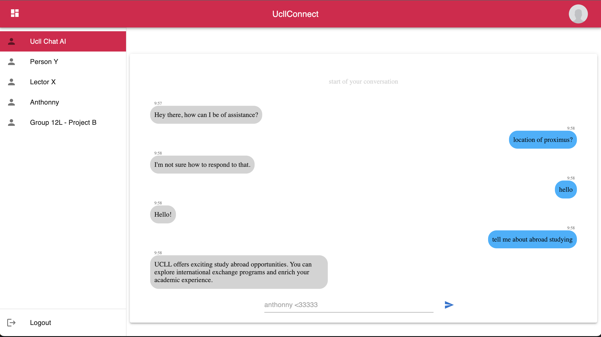

# Campus AI assistant

# Description
___

This chatbot is a combination of a trained model (few hundred conversations with given responses - small scaled). This is a model I trained myself so students can ask questions 
about the campus, courses, professors and links to any information that can be found on the schools website.

The second model is pretrained. DialoGPT-medium from Microsoft. A free model that is trained on 147M reddit discussions. https://github.com/microsoft/DialoGPT

The model is still far from perfect and is still in development. Currently when the probability of an input-response is higher than 1, it goes to the campus model. If its 
lower it chooses the Dialo model for better conversational skills. 

Current objective is to fine tune the DialoGPT model to handle the campus questions.

# starting the ChatBot:

**ON MAC:** 
**make a virtual environment**
___
> python3.8 -m venv myenv

> source myenv/bin/activate

**ON WINDOWS:**
___
> python -m venv myenv

>myenv\Scripts\activate 

(if this command fails, try > Set-executionPolicy RemoteSigned -Scope Process) and run the myenv\Scripts\activate again

when in environment pip install the following packages:
___
> pip install flask pip install torch pip install nltk pip install numpy pip install certifi pip install matplotlib 
pip install flask_cors pip install scikit-learn (you can run this whole command)

> py app.py/python3 app.py

